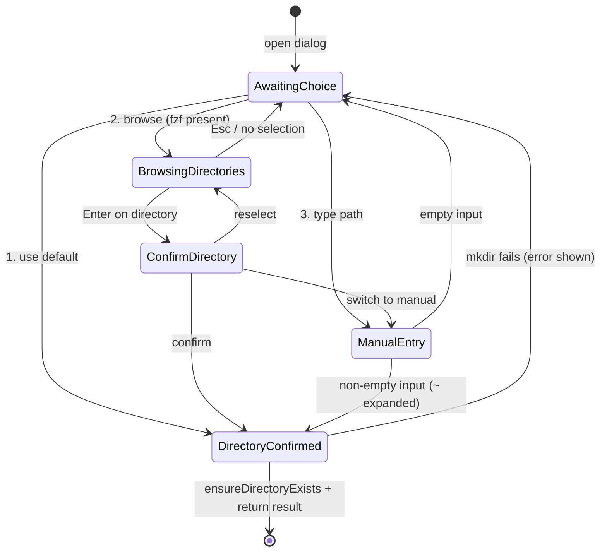

# Output Directory Selection Subsystem

**Created**: 2026-08-29
**Completed**: In Progress
**Status**: 🔴 Not Started (awaiting approval)
**Purpose**: Make clip output directories default to the program's instantiation directory and provide fzf-driven directory browsing with live name suggestions, replacing all free-text-only directory prompts.

---

## Problem Statement

Output directory selection is the weakest part of the clip workflows. The input side has a polished sub-system (fzf fuzzy search, previews, confirm/reselect loops), while the output side is a bare text prompt.

1. **Hardcoded, frozen default**: `resolveAppPaths` falls back to `~/Music/AudioExtracted` ([src/app/paths.ts:41](../../src/app/paths.ts)). Worse, `ConfigManager.loadConfig` writes the defaults to `config.json` on first run ([src/config/config.ts:99](../../src/config/config.ts)), so that value gets frozen forever — even if the user never chose it.
2. **No browsing, no suggestions**: Every directory choice — the per-clip "Output directory" prompt (`OutputDestinationDialog`), the custom-dir branch of `promptForSingleOutput`, and the settings menu's "Change output directory" — is a hand-typed path with no picker, no `~` expansion, and no feedback. The existing fzf sub-system is files-only: `buildFzfShellCommand` hard-codes `find -type f` ([src/utils/fzf.ts:72](../../src/utils/fzf.ts)).
3. **Silent failure on new folders**: Interactive clip flows never create the chosen directory (no `ensureDirectoryExists` anywhere on the path), so pointing at a not-yet-existing folder makes ffmpeg fail with a path error. The flag-based CLI path already does `mkdirSync(recursive)` ([src/index.ts:362](../../src/index.ts)) — the behaviors disagree.

Net effect: users must know and type full paths by hand for every clip run, and the default points at an arbitrary folder that was never chosen.

---

## Design Decisions (Stakeholder Preferences)

| Decision | Choice |
| :--- | :--- |
| Default output directory | `process.cwd()` captured once at startup (the `mat` launcher `exec`s without `cd`, so cwd = invocation directory) |
| Persisted `defaultOutputDir` | Optional user override only — never auto-written; dynamic default when absent |
| Legacy `~/Music/AudioExtracted` values | Dropped on config load (migration); user-chosen values preserved |
| Directory browsing engine | fzf, reusing the existing `FzfSelector` — `find -type d` candidates, live fuzzy filtering |
| Predictive suggestions | fzf's built-in incremental fuzzy matcher over a directory-only candidate list — no custom suggestion engine |
| fzf fallback | Hide "browse" option; numbered menu degrades to default/manual only (mirrors `selectFileWithFzf` pattern) |
| Directory creation | `ensureDirectoryExists` (mkdir -p) on every confirmed selection, in the dialog |
| Log directory | Decoupled from output dir → `paths.baseDir/logs` (a cwd default must not spray `logs/` into every folder) |
| Browse depth | `maxDepth = 5` default for directory finds (keeps candidate lists responsive on large trees) |
| Preview in directory mode | Disabled — the ffprobe/bat preview is file-oriented |

KISS/DRY notes: no new modules or abstraction layers — all changes extend existing files (`paths.ts`, `config.ts`, `fzf.ts`, `interface.ts`, `output-destination.ts`, `settings-menu.ts`, `logger.ts`). One command builder, one dialog helper shared by both dialog entry points.

---

## Solution Architecture

### Default resolution chain (per read, not frozen)

```mermaid
flowchart TD
    A[Output dir needed] --> B{Explicit per-run choice<br/>(dialog result)?}
    B -- yes --> R1[Chosen directory]
    B -- no --> C{config.json override<br/>(user-set only)?}
    C -- yes --> R2[Override directory]
    C -- no --> D{MULTIMEDIA_TOOLKIT_OUTPUT_DIR set?}
    D -- yes --> R3[Env directory]
    D -- no --> R4[process.cwd() at startup]
```

Precedence preserves today's semantics (file config beats env var); only the bottom default changes from `~/Music/AudioExtracted` to cwd.

### Directory selection finite state machine

This FSM governs `OutputDestinationDialog.promptForOutputDirectory`, the custom-dir branch of `promptForSingleOutput`, and the settings-menu picker.



Entry conditions: `BrowsingDirectories` is only reachable when `fzf.isFzfAvailable()`; otherwise the menu renders without the browse option. Cancellation ("go back" on the choice menu) aborts the dialog and the calling workflow, matching current behavior.

---

## Implementation Tasks

### Phase 1: Dynamic Default 🔴

#### Task 1.1: cwd fallback in `resolveAppPaths` 🔴
**File**: `src/app/paths.ts`

```ts
export interface AppPathsOptions {
  baseDir?: string;
  defaultOutputDir?: string;
  env?: NodeJS.ProcessEnv;
  homeDir?: string;
  cwd?: string; // injectable for tests; defaults to process.cwd()
}

const cwd = options.cwd ?? process.cwd();
const defaultOutputDir =
  options.defaultOutputDir ?? env.MULTIMEDIA_TOOLKIT_OUTPUT_DIR ?? cwd;
```

**Key Logic/Responsibilities**:
* Captured once at startup — the instantiation directory, not "whatever cwd is later".
* `~/Music/AudioExtracted` disappears entirely.
* Existing test-isolation guards in `src/app/context.ts` (which reject the legacy fallback) keep working unchanged.

#### Task 1.2: `defaultOutputDir` becomes an explicit override 🔴
**File**: `src/config/config.ts`

Three coordinated changes:

```ts
// 1. loadConfig: migrate legacy frozen values before merging
const fileConfig = JSON.parse(readFileSync(this.paths.configFile, 'utf-8'));
const legacyDefault = join(homedir(), 'Music', 'AudioExtracted');
if (fileConfig.defaultOutputDir === legacyDefault) {
  delete fileConfig.defaultOutputDir;
}
return { ...this.defaultConfig, ...fileConfig };

// 2. saveConfig: never persist the dynamic default
private shouldPersistOutputDir(value: string): boolean {
  return value !== this.paths.defaultOutputDir;
}

// 3. resetOutputDir: return to the dynamic default (used by settings menu)
resetOutputDir(): void {
  this.config.defaultOutputDir = this.paths.defaultOutputDir;
  this.saveConfig(this.config);
}
```

**Key Logic/Responsibilities**:
* First-run default save no longer freezes cwd into `config.json`.
* `config.set('defaultOutputDir', dir)` still persists a genuine user override (rule 2 is a no-op for it unless the user picked the startup dir — in which case dynamic and override are the same path anyway).
* `resetOutputDir()` relies on rule 2: setting the value back to the dynamic default auto-unpersists it.

#### Task 1.3: Logger log dir decoupling 🔴
**File**: `src/utils/logger.ts`, `src/app/context.ts`

```ts
// logger.ts — optional override, old behavior as fallback
constructor(deps: LoggerDeps & { logDir?: string }) {
  this.logDir = deps.logDir ?? join(this.config.get('defaultOutputDir'), 'logs');
}

// context.ts — wire it
const logger = new Logger({ config, db, clock, logDir: join(paths.baseDir, 'logs') });
```

**Key Logic/Responsibilities**:
* Consequence of the cwd default: logs belong with app state (`~/.multimedia-toolkit/logs`), not in whatever folder the tool was launched from.
* Optional parameter keeps existing constructor call sites and tests valid.

---

### Phase 2: fzf Directory Mode 🔴

#### Task 2.1: `entryType` option in the shell-command builder 🔴
**File**: `src/utils/fzf.ts`

```ts
export interface FzfOptions {
  // ...existing fields...
  entryType?: 'files' | 'directories'; // default 'files'
}

// buildFzfShellCommand
const entryType = options.entryType ?? 'files';

let findCmd = `find "${options.directory}"`;
if (options.maxDepth !== undefined) {
  findCmd += ` -maxdepth ${options.maxDepth}`;
}
if (!options.showHidden) {
  findCmd += ` -not -path '*/\\.*'`;
}
findCmd += entryType === 'directories' ? ' -type d' : ' -type f';
if (entryType === 'files' && options.extensions.length > 0) {
  // existing extension filter block, unchanged
}
```

**Key Logic/Responsibilities**:
* One builder, two entry types — DRY; file mode byte-identical to today when `entryType` is absent.
* Extension filters and media previews are file-mode-only by construction.
* Hidden directories stay excluded by the existing `-not -path '*/\.*'` rule (`.git`, `.cache`, … never pollute suggestions).

#### Task 2.2: `selectDirectory` on `FzfSelector` 🔴
**File**: `src/utils/fzf.ts`

```ts
async selectDirectory(options: {
  directory?: string;
  prompt?: string;
  maxDepth?: number;
} = {}): Promise<OperationResult<string>> {
  const result = await this.selectFiles({
    directory: options.directory,
    multi: false,
    extensions: [],
    preview: false,
    prompt: options.prompt || 'Select directory',
    entryType: 'directories',
    maxDepth: options.maxDepth ?? 5
  });
  if (!result.success) return result;
  return { success: true, data: result.data![0] };
}
```

**Key Logic/Responsibilities**:
* Reuses `selectFiles` validation (exists, is-directory, fzf availability) — no duplicated logic.
* `maxDepth 5` keeps `find` responsive when launched from a large tree.

---

### Phase 3: Selection Dialog 🔴

#### Task 3.1: `selectDirectoryWithFzf` feedback loop 🔴
**File**: `src/cli/interface.ts`

A sibling of `selectFileWithFzf` ([src/cli/interface.ts:605](../../src/cli/interface.ts)) using the same helpers (`suspendReadline`, `runNumberedMenu`): browse → confirm ("Use this directory" / "Reselect" / "Manual input") → on Esc/cancel offer retry/manual/back. Returns `''` when the user goes back. Resolves the fzf result (root-prefixed relative path) to an absolute path before returning.

#### Task 3.2: Three-way choice in the output dialog 🔴
**File**: `src/cli/dialogs/output-destination.ts`

```ts
private async chooseOutputDirectory(defaultDir: string): Promise<string | null> {
  const fzfAvailable = await this.cli['fzf'].isFzfAvailable(); // via a small public accessor on CLIInterface
  const options = [
    { label: `Use default (${defaultDir})`, value: 'default' },
    ...(fzfAvailable ? [{ label: 'Browse directories (fzf)', value: 'browse' }] : []),
    { label: 'Type path manually', value: 'manual' }
  ];
  // numbered menu → dispatch:
  //   default → defaultDir
  //   browse  → cli.selectDirectoryWithFzf({ directory: defaultDir })
  //   manual  → prompt with '~' expansion, empty input returns to the menu
  // On confirm: ensureDirectoryExists, catch → error + back to menu
}
```

**Key Logic/Responsibilities**:
* `promptForOutputDirectory` and the custom-dir branch of `promptForSingleOutput` both delegate here — one selection flow everywhere (DRY).
* `defaultDir` argument is `ctx.config.get('defaultOutputDir')`, which after Phase 1 resolves to override/env/cwd.
* `ensureDirectoryExists(null, dir)` closes the interactive mkdir gap; failure loops back to the choice menu instead of crashing.
* `~` expansion on manual entry: leading `~` → `homedir()` (one line, no helper module).
* Existing rename prompt stays untouched after directory confirmation.

---

### Phase 4: Settings, Docs, Verification 🔴

#### Task 4.1: Settings menu picker 🔴
**File**: `src/cli/menus/settings-menu.ts`

* "Change output directory" runs `cli.selectDirectoryWithFzf` with manual-input fallback, then `config.set('defaultOutputDir', dir)`.
* New menu item "Reset output directory to startup default" → `config.resetOutputDir()`.

#### Task 4.2: Tests 🔴
**Files**: `src/app/paths.test.ts` (new), `src/utils/fzf.test.ts` (new), `src/cli/dialogs/output-destination.test.ts` (new), `src/config/config.test.ts` (new)

* `paths.test.ts`: cwd fallback (inject `cwd`), env-var precedence, explicit-override precedence.
* `fzf.test.ts`: `buildFzfShellCommand` with `entryType: 'directories'` emits `-type d`, no extension filter, no preview flag; file mode unchanged.
* `config.test.ts`: legacy `~/Music/AudioExtracted` dropped on load; first-run save omits `defaultOutputDir`; explicit `set` persists; `resetOutputDir` clears.
* `output-destination.test.ts`: fake `CLIInterface` drives the menu FSM — default path, browse→confirm, manual with `~`, empty-input loop, mkdir failure recovery. (No fzf binary needed: the fake reports it unavailable for the no-browse case; browse cases stub `selectDirectoryWithFzf`.)

#### Task 4.3: Documentation + smoke 🔴
**Files**: `README.md`, `docs/configuration.md`, `test-fzf.ts`

* Document the new default (instantiation dir), the env var, the override semantics, and directory browsing.
* Extend `test-fzf.ts` with a directory-mode smoke check (AGENTS.md requires running it whenever `utils/fzf.ts` changes).

---

## File Summary

| File | Action | Status |
| :--- | :--- | :--- |
| `docs/plans/2026-08-29-output-directory-selection.md` | Create | 🟡 (this document) |
| `src/app/paths.ts` | Modify | 🔴 |
| `src/config/config.ts` | Modify | 🔴 |
| `src/utils/logger.ts` | Modify | 🔴 |
| `src/app/context.ts` | Modify | 🔴 |
| `src/utils/fzf.ts` | Modify | 🔴 |
| `src/cli/interface.ts` | Modify | 🔴 |
| `src/cli/dialogs/output-destination.ts` | Modify | 🔴 |
| `src/cli/menus/settings-menu.ts` | Modify | 🔴 |
| `src/app/paths.test.ts` | Create | 🔴 |
| `src/utils/fzf.test.ts` | Create | 🔴 |
| `src/config/config.test.ts` | Create | 🔴 |
| `src/cli/dialogs/output-destination.test.ts` | Create | 🔴 |
| `test-fzf.ts` | Modify | 🔴 |
| `README.md` | Modify | 🔴 |
| `docs/configuration.md` | Modify | 🔴 |

---

## Execution Order

1. **Phase 1** — dynamic default + override semantics + log-dir decoupling (foundation; everything else reads the new resolution).
2. **Phase 2** — fzf directory mode (pure extension, independently testable).
3. **Phase 3** — selection dialog FSM wired into both dialog entry points.
4. **Phase 4** — settings menu, tests, docs, `bun test` + `bun build` + `test-fzf.ts` verification.

---

## Edge Cases to Handle

1. **fzf not installed** — browse option hidden; default/manual still fully functional 🔴
2. **Chosen directory does not exist** — created via `ensureDirectoryExists` before returning 🔴
3. **Esc / empty selection in fzf** — returns to the choice menu, never a dead end 🔴
4. **Legacy config frozen on `~/Music/AudioExtracted`** — dropped at load; deliberate overrides survive 🔴
5. **Launched from a huge tree (e.g. `$HOME`)** — `maxDepth = 5` bounds candidate generation 🔴
6. **`mkdir` failure (permissions)** — error surfaced, dialog returns to the choice menu 🔴
7. **Manual entry with `~`** — expanded to home before validation 🔴
8. **Relative paths from fzf output** — resolved to absolute against the browse root 🔴
9. **`MULTIMEDIA_TOOLKIT_OUTPUT_DIR`** — continues to work, sits between override and cwd 🔴
10. **User override equal to the startup dir** — not persisted; dynamic default yields the identical path (behaviorally invisible) 🔴

---

## Rollback Plan

1. `git revert` the implementation commits — every change is code-level; no data migration exists to undo.
2. Config files remain valid in both directions: an override key written by the new code is simply a normal `defaultOutputDir` value to the old code; absence of the key falls back to the legacy default.
3. Logs re-locate from `~/.multimedia-toolkit/logs` back into the output dir automatically once the old Logger wiring is restored.

---

## Success Criteria

- [ ] Fresh run in any directory: output prompt default shows that directory (no `config.json` required)
- [ ] "Browse directories" opens fzf listing only directories, live-fuzzy-filtered as you type (predictive suggestions)
- [ ] Esc, reselect, manual input, and go-back all navigate the FSM without dead ends
- [ ] A newly typed or browsed-to missing directory is created; clips land in it (audio + video workflows)
- [ ] On a machine without fzf, the menu degrades to default/manual and clips still work
- [ ] Settings menu can set an override and reset to the startup default; legacy configs migrate cleanly
- [ ] `bun test` passes including the four new test files; `bun build` succeeds; `bun run test-fzf.ts` passes
- [ ] No `logs/` directory appears in the instantiation folder

---

## Implementation Walkthrough

To be completed after execution: test results, new files, and modified-file change summary.
